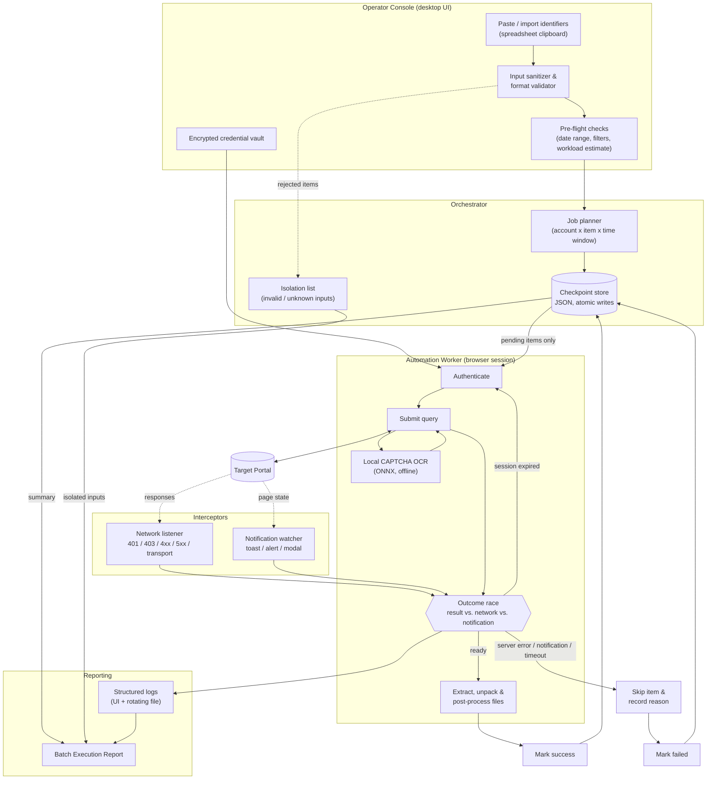

# Enterprise Tax Extraction Engine

**A fault-tolerant automation engine that extracts and post-processes tax filings at scale, staying fast and predictable when networks, sessions and CAPTCHAs misbehave.**

[](#tech-stack)
[](#tech-stack)
[](#tech-stack)
[](#tech-stack)
[](#tech-stack)
[](#tech-stack)
[](#about-the-code-samples)

> **Case-study repository.** It documents the architecture, the engineering
> problems and the outcomes of a production system. The code in
> [`src_sample/`](src_sample) consists of **clean reference implementations of
> the underlying patterns**, not the production source. Nothing here identifies a
> client, a portal or a real endpoint. See [About the code samples](#about-the-code-samples).

---

## Table of Contents

1. [Executive Summary](#executive-summary)
2. [At a Glance](#at-a-glance)
3. [Key Technical Challenges & Solutions](#key-technical-challenges--solutions)
4. [System Architecture](#system-architecture)
5. [Performance Metrics & Impact](#performance-metrics--impact)
6. [Tech Stack](#tech-stack)
7. [Repository Structure](#repository-structure)
8. [About the Code Samples](#about-the-code-samples)
9. [Running the Samples](#running-the-samples)
10. [Responsible Automation](#responsible-automation)
11. [License](#license)

---

## Executive Summary

Finance and accounting teams that manage hundreds of taxpayer records spend days
downloading, unpacking, renaming and filing documents from web portals by hand.
The work is repetitive, error-prone and fragile: a portal session expires
halfway through, a CAPTCHA appears, a server hiccups, and the operator has to
start over.

The **Enterprise Tax Extraction Engine** automates the whole loop, from
*input → authentication → search → download → post-processing → reporting*, as a
desktop application that runs entirely on the operator's machine. It is built
around one idea: **failures are normal, so they must be detected in seconds,
isolated to the smallest possible unit, and recoverable without repeating
completed work.**

Highlights:

- **Local, offline CAPTCHA recognition**: a lightweight ONNX model, no third-party service, no data leaving the machine.
- **Event-driven failure detection**: server errors, expired sessions and on-page notifications are recognised within about 2 seconds instead of after a default timeout.
- **Checkpoint & resume**: every item's state is persisted; after an interruption only unfinished work runs.
- **Enterprise-grade observability**: structured, multi-tier logging and an automatic *Batch Execution Report* after every run.
- **Safe input handling**: paste thousands of rows straight from a spreadsheet; inputs are sanitised and validated before a single request is made.

## At a Glance

| | |
|---|---|
| **Problem** | Large-scale, repetitive document retrieval from a web portal; long runs that collapse on the first network, session or CAPTCHA failure. |
| **Solution** | A resilient automation engine with event-driven failure detection, durable checkpoints and pre-flight validation, packaged as a desktop app. |
| **Outcome** | Failure handling ~120x faster, interrupted runs resume with zero re-work, and manual operating effort cut by an estimated ~95%. |
| **My role** | Architecture, implementation, testing, packaging and technical documentation. |

---

## Key Technical Challenges & Solutions

### 1. Local CAPTCHA OCR (offline, low latency)

**Challenge.** Every query is gated by a CAPTCHA. Cloud solvers add latency, cost and
a data-privacy problem, and they are unacceptable for a corporate deployment.

**Solution.** A compact ONNX-based recogniser runs **inside the client process**.
The model is loaded lazily once, can be warmed up in the background, and every call
returns its own latency for monitoring. An OpenCV preprocessing step (grayscale +
Otsu thresholding) cleans the image before inference, and a bounded, adaptive
retry policy handles the occasional misread.

| | |
|---|---|
| Latency | **< 0.5 s per image** including cold start (typically ~10 ms once warm) |
| Accuracy | **> 90 % end-to-end pass rate** with adaptive retry |
| Privacy | 100 % on-device; no image is ever transmitted |

> Reference pattern: [`src_sample/core/ocr_engine.py`](src_sample/core/ocr_engine.py)

### 2. Timeout Deadlock Elimination *(the highlight)*

**Challenge.** Browser automation typically waits for "the results table" and gives
up after a generous default timeout. When the portal responds with an error, a
"session expired" redirect or a toast such as *"service unavailable"*, the table
never appears and the bot **freezes until the timeout**. Combined with retries, a single
bad request could stall the run for **around four minutes**, and to an observer it looks
exactly like a hung program.

**Solution.** Replace *"wait for the table"* with a **race between independent signals**:

| Signal | Source | Meaning |
|---|---|---|
| Result ready | DOM condition | Continue normally |
| **HTTP 401 / 403** | Network interception | Session expired, re-authenticate and retry the item |
| **HTTP 5xx / 4xx / transport error** | Network interception | Log the status, skip the item, move on |
| **Toast / alert / modal text** | On-page notification watcher | Record the message **verbatim** and end the wait |
| Nothing at all | Bounded timeout | Skip with a clear reason |

The first signal to fire wins, so the engine reacts in **~1-2 seconds** instead of
sitting in a timeout. The approach relies on **HTTP semantics and generic notification
patterns rather than portal-specific markup**, so it survives front-end redesigns.

```text
Before:  submit ──────────────── wait 45 s ──▶ retry ──▶ wait 45 s ──▶ ... (~4 min)
After :  submit ──▶ 5xx / 403 / toast detected in ~1-2 s ──▶ act immediately
```

> Reference pattern: [`src_sample/core/network_listener.py`](src_sample/core/network_listener.py) ·
> diagram: [`docs/architecture_diagram.md`](docs/architecture_diagram.md#2-failure-detection-event-race-instead-of-a-fixed-timeout)

### 3. Fault-Tolerant State Recovery (Checkpoint & Resume)

**Challenge.** Runs last from minutes to hours. Power cuts, network drops and server
faults are inevitable, and restarting from zero wastes time and re-hits the portal.

**Solution.** Every item carries a durable state, persisted to a local JSON checkpoint
with **atomic writes** (temp file + `os.replace` + `fsync`), so a crash can never leave a
half-written file.

```json
{
  "schema": 1,
  "job_id": "batch-2025-001",
  "items": [
    { "item_id": "item-001", "status": "success",     "attempts": 1, "error": null },
    { "item_id": "item-002", "status": "failed",      "attempts": 2, "error": "HTTP 503 (upstream)" },
    { "item_id": "item-003", "status": "in_progress", "attempts": 1, "error": null },
    { "item_id": "item-004", "status": "pending",     "attempts": 0, "error": null }
  ]
}
```

| State at restart | Behaviour |
|---|---|
| `success` | Skipped, never processed twice |
| `failed` | Retried once the operator fixes the cause and presses **Resume** |
| `in_progress` | Treated as `pending` (it was interrupted) |
| new items | Added; existing progress is preserved |

The operator can correct input, press **Resume**, and the engine skips everything already
done and processes only the remaining work. Foreign or corrupt checkpoints are never
silently overwritten.

> Reference pattern: [`src_sample/core/state_manager.py`](src_sample/core/state_manager.py)

### 4. Enterprise Batch Logging & Summary Reporting

**Challenge.** After a large run, "did it work?" must be answerable in ten seconds,
and a support engineer needs enough detail to diagnose problems without asking the
operator to reproduce them.

**Solution.**

- **Structured, multi-tier logging**: a concise live feed for the operator, a detailed rotating file log with full tracebacks for engineers, and log levels that can be raised without code changes.
- **Batch Execution Report** generated automatically at the end of every run.

```text
==================== BATCH EXECUTION REPORT ====================
  Duration        : 00:41:12  (start 09:02:10 -> end 09:43:22)
  Scope           : 3 accounts, 128 items, 2 date windows
  ---- Outcome ----
  Succeeded       : 121 / 128
  Failed          : 4    (2x server error, 1x session expired, 1x download error)
  Isolated inputs : 3    (invalid format - not processed, never deleted)
  ---- Files ----
  Saved           : 1,940     Duplicates skipped: 212
  ---- Verdict ----
  [COMPLETED WITH WARNINGS] Re-run with the same settings to retry failures only.
================================================================
```

Every failure carries a **reason**, and the report closes with an actionable recovery hint.

### 5. Input Sanitization & Format Validation

**Challenge.** Operators paste identifiers from spreadsheets: newline-separated
columns, tab-separated rows, stray spaces, invisible characters, duplicates and typos.
Bad input wastes runs and, worse, wastes portal quota.

**Solution.** A small pipeline: **normalise → tokenise → validate → isolate**.

- Paste **thousands of rows** straight from a spreadsheet (columns, rows or mixed).
- Whitespace and invisible characters are cleaned; empty cells are dropped.
- Each token is validated against strict canonical formats (the values below are fictitious):

| Format | Example | Valid |
|---|---|---|
| 10 digits | `0123456789` | yes |
| 12 digits | `012345678901` | yes |
| Branch (10-3) | `0123456789-001` | yes |
| Too short | `123456789` | no |
| Malformed branch suffix | `0123456789-01` | no |

- Invalid entries are **flagged and isolated, never silently deleted or "auto-fixed"**: the run proceeds with valid items and the isolated ones are listed in the final report.
- The same **pre-flight** discipline covers other inputs (date ranges, filters) and shows a **workload estimate** before a long run starts.

> Reference pattern: [`src_sample/utils/tax_validator.py`](src_sample/utils/tax_validator.py)

---

## System Architecture



More diagrams (event-race sequence and item lifecycle):
[`docs/architecture_diagram.md`](docs/architecture_diagram.md).

**Design principles**

1. **Fail fast, fail small.** Detect problems in seconds and confine them to one item.
2. **Never repeat completed work.** Progress is durable and idempotent.
3. **Never destroy user data.** Invalid input is isolated and reported, never deleted or guessed.
4. **Depend on protocols, not markup.** HTTP semantics and generic patterns outlive UI redesigns.
5. **Everything is explainable.** Each outcome has a reason, in the log and in the report.

---

## Performance Metrics & Impact

| Metric | Before | After | Impact |
|---|---|---|---|
| Time to react to a portal error | up to **~240 s** (retries x default timeout) | **~2 s** | **~120x faster** |
| CAPTCHA recognition | n/a (manual) | **< 0.5 s** per image | fully automatic |
| Recovery after interruption | restart from zero | resume from the last checkpoint | **zero re-work** of completed items |
| Operator effort per batch | fully manual | supervised automation | **~95 % less manual time** *(estimate)* |

<sub>*Methodology.* Figures come from internal benchmarks on a controlled staging
environment and from comparing the automated flow against the equivalent manual
procedure; the effort reduction is an estimate. They illustrate the design goals
and are not guarantees for every environment.</sub>

---

## Tech Stack

| Layer | Technology |
|---|---|
| Language | Python 3.11 |
| Browser automation | Playwright (Chromium / installed Chrome) |
| OCR | ONNX Runtime via a lightweight recognition model |
| Image processing | OpenCV, NumPy |
| Desktop UI | Tkinter / CustomTkinter |
| Concurrency | Worker thread + event listeners; UI stays responsive through queue-based logging |
| Persistence | Local JSON checkpoint (atomic writes) |
| Observability | Python `logging` (structured, rotating file + live UI feed) |
| Packaging | PyInstaller (single-folder Windows distribution) |

---

## Repository Structure

```text
.
├── README.md                       # You are here
├── docs/
│   └── architecture_diagram.md     # Mermaid diagrams: data flow, event race, item lifecycle
└── src_sample/                     # Clean reference implementations of the patterns
    ├── core/
    │   ├── network_listener.py     # HTTP 4xx/5xx + session-expiry detection, event race
    │   ├── state_manager.py        # Checkpoint & resume
    │   └── ocr_engine.py           # Local ONNX / ddddocr wrapper
    └── utils/
        └── tax_validator.py        # Clipboard sanitisation + format validation
```

## About the Code Samples

The code in `src_sample/` is deliberately **reference-grade**: small, readable,
documented implementations of the *patterns* described above. They are written to be
studied, adapted and tested; they are **not** an excerpt of the production system.
The production code includes portal-specific adapters, tuned policies and operational
hardening that are intentionally out of scope for this repository.

- No client, portal, domain or endpoint is named. URL prefixes and selectors in the samples are placeholders.
- All identifier values shown are fictitious (`Ex: '0123456789'`).
- The samples follow standard, widely documented techniques and are provided for illustration.

## Running the Samples

```bash
python -m venv .venv && . .venv/bin/activate          # Windows: .venv\Scripts\activate
pip install playwright ddddocr opencv-python-headless numpy
playwright install chromium                            # only needed for network_listener.py

python src_sample/utils/tax_validator.py               # validation demo
python -m doctest -v src_sample/utils/tax_validator.py # run the documented examples
python src_sample/core/state_manager.py                # crash + resume demo
python src_sample/core/ocr_engine.py path/to/image.png # OCR timing demo
```

## Responsible Automation

The engine is designed for **authorised use**: operators run it with their own
accounts and permissions, on data they are entitled to access. It favours conservative
request behaviour, honours the portal's own error signals, and stops rather than
retrying aggressively when the server reports a problem.

## License

The code samples in [`src_sample/`](src_sample) are released under the
[MIT License](LICENSE). Documentation text and diagrams are
&copy; 2026 trungthe; please link back rather than republish them.

---

<sub>Example values in this repository are illustrative only. Trademarks belong to their respective owners.</sub>
