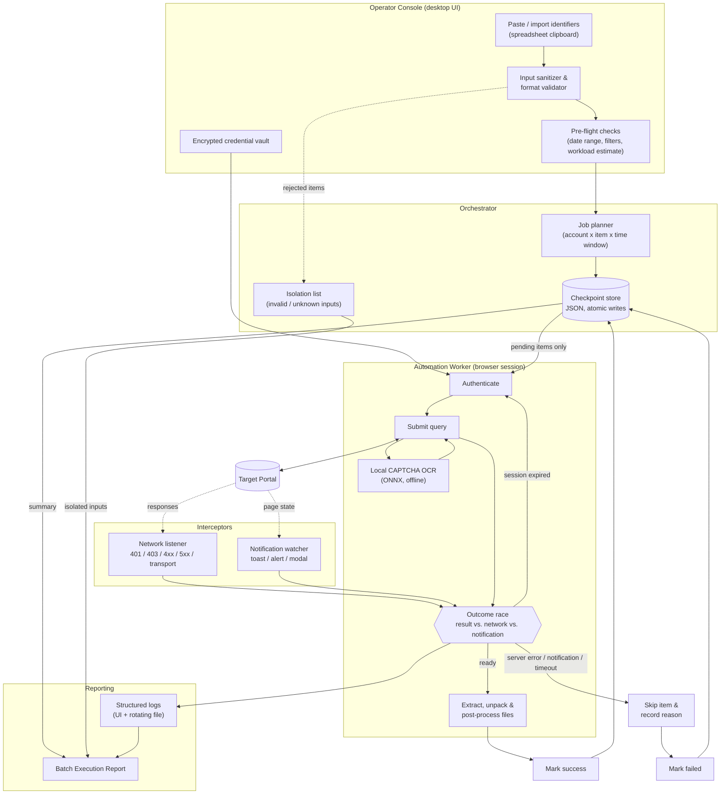
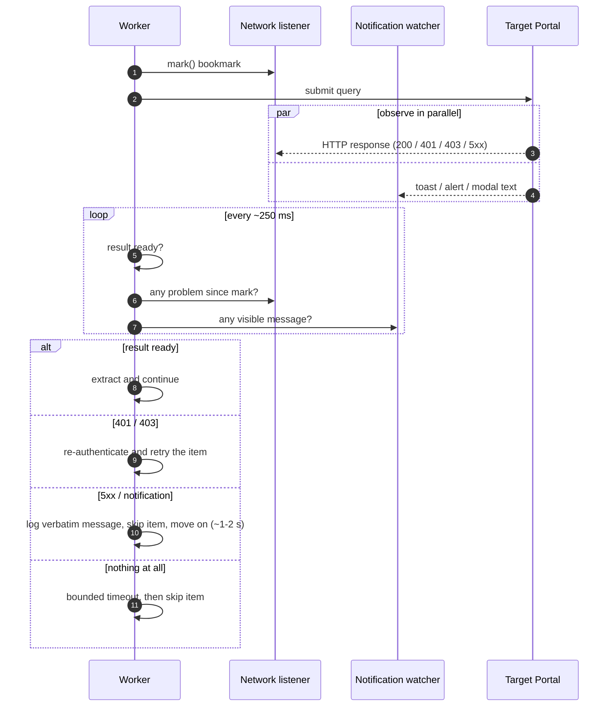
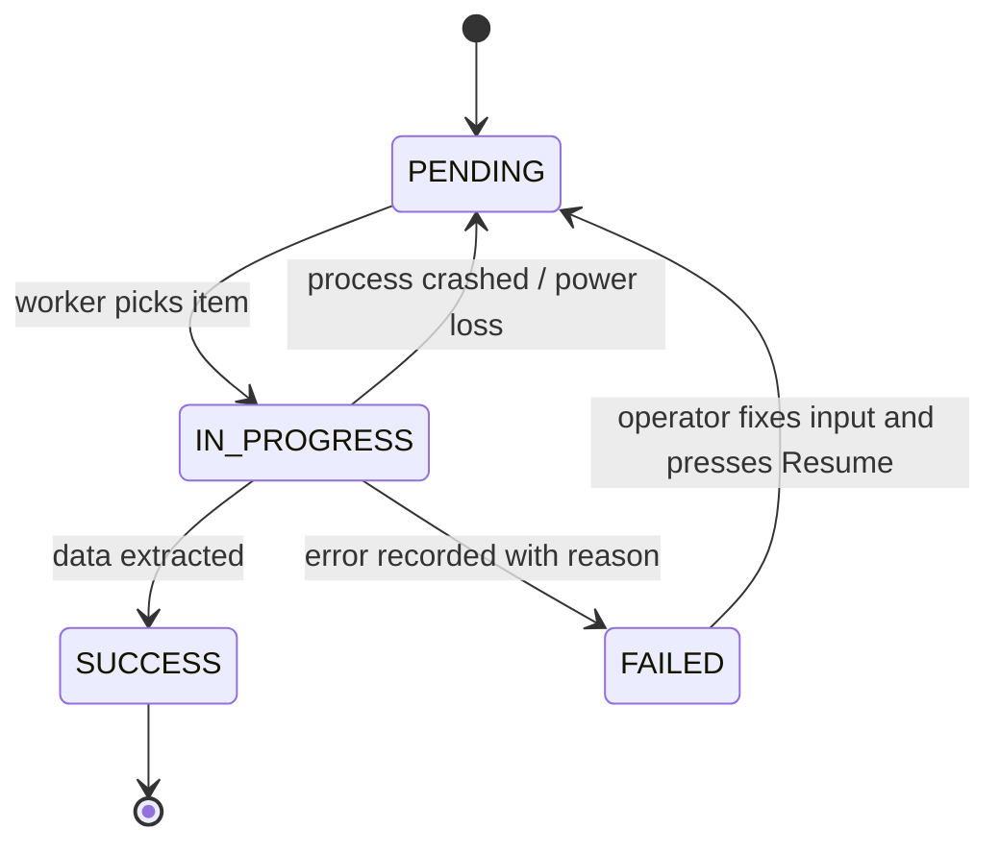

# Architecture Diagrams

> All diagrams are rendered natively by GitHub (Mermaid). The target system is
> intentionally shown as a generic **Target Portal**.

## 1. End-to-end data flow

## 2. Failure detection: event race instead of a fixed timeout

## 3. Item lifecycle and resume

**Resume rules**

| Item state at restart | Behaviour |
|---|---|
| `SUCCESS` | Never processed again |
| `FAILED` | Retried after the operator presses *Resume* |
| `IN_PROGRESS` | Treated as `PENDING` (it was interrupted) |
| `PENDING` | Processed normally |
| New items (input corrected) | Added as `PENDING`; existing progress is kept |
